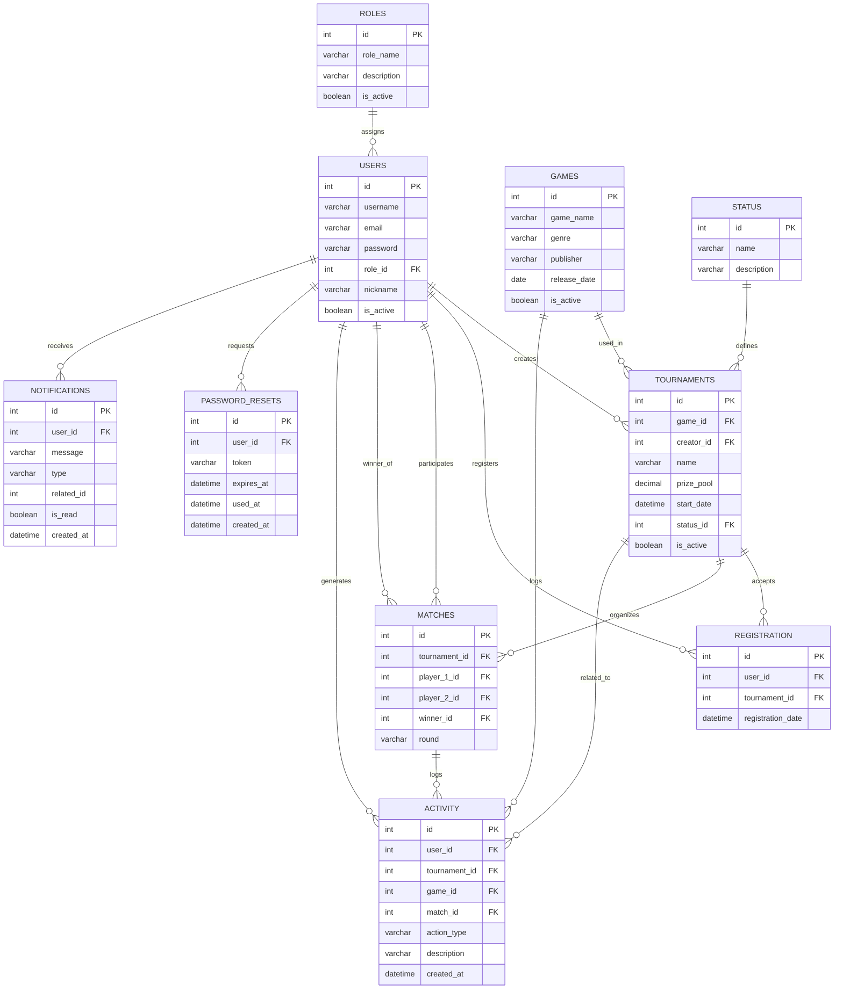

# Project Portfolio

## eSports Tournament Database System

---

**Institution:** CBTis 47 — Dirección General de Educación Tecnológica Industrial

**Subject:** Database / Integrative Project

**System Version:** v13.0.0

**Date:** June 2026

---

## 📹 Video Demo

[](https://drive.google.com/file/d/1r1Nr2p-P64E8iyHAccyi7GYlkMX5uzKQ/view)

<p align="center">
  <a href="https://drive.google.com/file/d/1r1Nr2p-P64E8iyHAccyi7GYlkMX5uzKQ/preview" target="_blank">
    
  </a>
</p>

---

## Table of Contents

1. [Executive Summary](#1-executive-summary)
2. [Objectives](#2-objectives)
3. [Development Team](#3-development-team)
4. [Technology Stack](#4-technology-stack)
5. [System Architecture](#5-system-architecture)
6. [Database Design](#6-database-design)
7. [Implemented Features](#7-implemented-features)
8. [Development Methodology (Scrum)](#8-development-methodology-scrum)
9. [Installation Guide](#9-installation-guide)
10. [Conclusions](#10-conclusions)

---

## 1. Executive Summary

**eSports Tournament Database System** is a full-stack web application designed to simplify the organization and management of competitive gaming tournaments. The system provides a centralized platform where administrators and players can manage tournaments, registrations, matches, statistics, and real-time notifications.

The project was developed following modern software engineering practices, combining a responsive React frontend, a scalable Node.js/Express backend, and a normalized relational MySQL database.

### Main Features

- Full tournament management (CRUD)
- JWT-based authentication with role-based access control
- Automatic bracket generation and match management
- Player profiles with win/loss statistics
- Global and per-tournament leaderboards
- Real-time notifications via Socket.io
- Statistics dashboard with Chart.js
- Cyber Neon visual theme with animated background
- Password reset via email

---

## 2. Objectives

### General Objective

Develop a functional web system for eSports tournament administration that integrates a normalized relational database, a REST API backend, and an interactive frontend.

### Specific Objectives

1. Design a relational database in Third Normal Form (3NF) with referential integrity
2. Implement a secure authentication system with JWT and bcrypt-encrypted passwords
3. Develop a complete tournament module with player registration and automatic bracket generation
4. Provide visual statistics through dynamic charts
5. Implement real-time notifications using WebSockets
6. Deliver a responsive interface with a Cyber Neon theme

---

## 3. Development Team

| Role | Member | Main Responsibility |
|------|--------|---------------------|
| 📊 Analyst & Designer (Architect) | Galán Torres Citlalli | ERD modeling, normalization (3NF), Data Dictionary |
| 💾 SQL Developer (Builder) | Olazo Caamaño Emmanuel | DDL, data types, constraints, foreign keys, SQL scripts |
| 🔎 Query Master (Manipulator) | Jimenez Solis Caleb | Seed data, JOIN queries, business intelligence reports |
| 🧪 QA / Tester (Breaker) | Lopez Gil Dilan Osmar | Integration testing, referential integrity validation |
| 🛡️ Database Administrator (Guardian) | Aguilar Medina Angel Uriel | Security, permissions, backups, final deliverable assembly |

---

## 4. Technology Stack

### Frontend

| Technology | Version | Purpose |
|------------|---------|---------|
| React.js | 19 | User interface framework (SPA) |
| React Router DOM | 7 | Client-side routing |
| Axios | 1 | HTTP client for API communication |
| Chart.js / react-chartjs-2 | 4 / 5 | Statistics visualization |
| Socket.io-client | — | Real-time communication |
| CSS3 / Canvas API | — | Styling and animations |

### Backend

| Technology | Version | Purpose |
|------------|---------|---------|
| Node.js | 22 LTS (Jod) | JavaScript runtime environment |
| Express.js | 5 | Web framework for REST API |
| MySQL2 | 3 | MySQL connection driver |
| bcrypt | 6 | Password hashing |
| jsonwebtoken | — | Token-based authentication |
| Socket.io | — | Bidirectional real-time communication |
| Nodemailer | — | Email sending service |

### Database

| Technology | Purpose |
|------------|---------|
| MySQL 8 | Relational database engine |
| DDL / SQL | Schema definition and manipulation |
| Foreign Keys / UNIQUE | Referential integrity and uniqueness |
| Normalization (3NF) | Redundancy-free design |

---

## 5. System Architecture

The system follows a **client-server** architecture with an **MVC** pattern on the backend:

```
Frontend (React SPA)
  │
  │  services/api.js             ← Centralized services layer (Axios)
  │  services/tournamentService.js
  │  services/userService.js
  │  services/matchService.js
  │  services/leaderboardService.js
  │  services/notificationService.js
  │  services/socket.js
  │
  │  HTTP Requests (JSON) + WebSockets
  ▼
Backend (Node.js + Express)
  │
  │  routes/                     ← Route definitions
  │  controllers/                ← Business logic per module
  │  utils/                      ← Helper functions (auth, validations)
  │  db.js                       ← MySQL connection (mysql2)
  │  index.js                    ← Server entry point
  │
  ▼
MySQL 8 Database
  │
  │  9 relational tables
  │  Foreign keys and constraints
  │  Third Normal Form (3NF)
```

### Real-Time Communication

Socket.io enables bidirectional events between server and clients:

- `tournament:created` — notification when tournament is created
- `tournament:updated` — notification when tournament is edited
- `tournament:statusChanged` — status change notification
- `tournament:registered` — registration confirmation
- `match:created` — new match created
- `match:result` — match result reported
- `notification` — personalized user notification

---

## 6. Database Design

### Entity-Relationship Diagram



### Database Tables

The system contains **9 relational tables** designed in Third Normal Form (3NF):

| Table | Description | Key Relationships |
|-------|-------------|-------------------|
| **ROLES** | System roles (admin, player) | 1:N with USERS |
| **USERS** | Registered users | FK → ROLES |
| **STATUS** | Tournament statuses (open, in progress, finished) | 1:N with TOURNAMENTS |
| **GAMES** | Video game catalog | 1:N with TOURNAMENTS |
| **TOURNAMENTS** | Tournaments created by admins | FK → GAMES, STATUS, USERS |
| **REGISTRATION** | Player ↔ tournament enrollment (N:M) | FK → USERS, TOURNAMENTS, UNIQUE(user_id, tournament_id) |
| **MATCHES** | Matches within tournaments | FK → TOURNAMENTS, USERS (player_1, player_2, winner) |
| **NOTIFICATIONS** | In-app notifications | FK → USERS |
| **PASSWORD_RESETS** | Password recovery tokens | FK → USERS |
| **ACTIVITY** | System activity log | FK → USERS, TOURNAMENTS, GAMES, MATCHES |

### Design Principles Applied

1. **Normalization (3NF):** All tables are in Third Normal Form, eliminating redundancy and transitive dependencies
2. **Referential Integrity:** Foreign keys (FOREIGN KEY) on all child tables using InnoDB engine
3. **Uniqueness:** UNIQUE constraints on fields such as username, email, game_name, and the user_id + tournament_id combination
4. **Appropriate Data Types:** DECIMAL for prizes, DATETIME for dates, VARCHAR with precise lengths
5. **Naming Convention:** snake_case for all database identifiers

---

## 7. Implemented Features

### 7.1 Authentication and Security

- Player registration with uniqueness validation (username, email)
- Login with JWT issuance (24h expiration)
- Password encryption with bcrypt
- Authentication middleware on all protected routes
- Role-based access control (admin / player)
- Axios interceptor for automatic token attachment

### 7.2 Tournament Management

- Full tournament CRUD (Create, Read, Update, Delete)
- Tournament status changes (open → in progress → finished)
- Tournament search with autocomplete
- Filters by status and text search

### 7.3 Player Registration

- Player enrollment in open tournaments
- Duplicate enrollment prevention (UNIQUE constraint)
- Registration cancellation
- View of tournaments a player is enrolled in

### 7.4 Match and Bracket System

- Automatic bracket generation with random pairing
- Round progression: Round 1 → Quarter-finals → Semi-finals → Final
- Match result reporting with winner validation
- Visual bracket viewer (match tree)
- Match history per player

### 7.5 Player Profiles

- Individual statistics: wins, losses, win rate
- Total matches and tournaments played
- Recent match history with results

### 7.6 Leaderboards

- Global ranking (top 100 by wins, win rate, matches, tournaments)
- Per-tournament ranking
- Medals (gold, silver, bronze) for top 3
- Tournament filter

### 7.7 Real-Time Notifications

- Notifications for match assignments, results, and registration changes
- Unread count badge in player panel
- Mark as read (individual or all)
- Communication via Socket.io

### 7.8 Statistics Dashboard (Admin)

- System metrics: total tournaments, active, pending, finished
- Total users (admins / players)
- Total matches (completed / pending)
- Activity chart (30-day timeline)
- Game popularity chart (bar chart)
- Top 10 players table
- System activity log

### 7.9 Admin Management

- Create new administrators
- List all administrators
- Demote admin to regular user (with self-demotion protection)

### 7.10 Password Reset

- Reset request via email
- Cryptographically secure token with 1-hour expiration
- Reset link in email
- Single-use token

### 7.11 User Interface

- Cyber Neon visual theme (dark with neon accents)
- Animated particle background (Canvas API)
- Responsive design (desktop and mobile)
- Dynamic video game carousel

---

## 8. Development Methodology (Scrum)

The project was developed using an **adapted Scrum methodology**, organized into 4 sprints over approximately 3 months.

### Sprint 1 — Database Foundation and Documentation

| Aspect | Detail |
|--------|--------|
| **Duration** | March 10–24, 2026 (2 weeks) |
| **Goal** | Foundational database structure, normalization, entity relationships |
| **Achievements** | ROLES, STATUS, USERS, GAMES, TOURNAMENTS tables, project skeleton |
| **Artifacts** | Data dictionary, ERD diagram, DDL script, CHANGELOG |

### Sprint 2 — Frontend Architecture, Player Management, and Security

| Aspect | Detail |
|--------|--------|
| **Duration** | April 5–8, 2026 (4 days) |
| **Goal** | Improve frontend maintainability, player visualization, security |
| **Achievements** | Modular structure refactor (pages/components/services), bcrypt encryption, role validation |
| **Artifacts** | Restructured frontend, secure authentication |

### Sprint 3 — Tournament Management, Registration, and Statistics

| Aspect | Detail |
|--------|--------|
| **Duration** | April 22 – May 5, 2026 (2 weeks) |
| **Goal** | Tournament features, registration, statistics, full integration |
| **Achievements** | Tournament CRUD, autocomplete registration, Chart.js dashboard, Cyber Neon theme, animated background, password reset |
| **Artifacts** | Functional tournament module, statistics panel, email service |

### Sprint 4 — JWT Authentication, Database Integrity, and Security Hardening

| Aspect | Detail |
|--------|--------|
| **Duration** | May 6 – June 4, 2026 (4 weeks) |
| **Goal** | JWT, FK constraints, environment variables, technical debt |
| **Achievements** | JWT tokens on all routes, FK constraints on all tables, .env variables, admin route protection |
| **Artifacts** | Fully secured API, database with complete referential integrity |

### Post-Sprint Enhancements (v13.0.0)

- Match and bracket system
- Player profiles
- Global and per-tournament leaderboards
- Real-time notifications
- Registration management (admin)
- Tournament results with standings and bracket view
- Advanced statistics

### Scrum Artifacts Generated

- **Product Backlog:** Prioritized user stories by epic
- **Sprint Backlog:** Tasks broken down per sprint
- **Sprint Reviews:** Validation of completed functionality
- **CHANGELOG.md:** Version history by component

---

## 9. Installation Guide

### Prerequisites

- Node.js 22+ LTS
- MySQL 8+
- npm

### Step 1: Clone the Repository

```bash
git clone https://github.com/olazocaamano/VideoGames-Tournament.git
cd VideoGames-Tournament
```

### Step 2: Configure Database

Run the SQL scripts in `consults/` to create the database and tables.

### Step 3: Configure Backend

```bash
cd backend
npm install
```

Create a `.env` file:

```env
PORT=5000
DB_HOST=localhost
DB_USER=root
DB_PASSWORD=yourpassword
DB_NAME=esports_tournaments
JWT_SECRET=your_secret_key
JWT_EXPIRES_IN=24h
FRONTEND_URL=http://localhost:3000
```

Start the server:

```bash
node index.js
# or with nodemon:
npx nodemon index.js
```

### Step 4: Configure Frontend

```bash
cd frontend
npm install
npm start
# or if using Vite:
npm run dev
```

### Access the System

- **Frontend:** http://localhost:3000
- **Backend API:** http://localhost:5000

---

## 10. Conclusions

### Achievements

1. **Robust database:** A relational database was designed and implemented in 3NF with 9 tables, foreign keys, UNIQUE constraints, and full referential integrity

2. **Functional full-stack application:** The system integrates frontend (React), backend (Node.js/Express), and database (MySQL) in a complete flow: Register → Login → Tournaments → Enrollment → Matches → Results

3. **Security implemented:** JWT authentication, bcrypt-encrypted passwords, role-based access control, and environment variables for sensitive credentials

4. **Real-time capabilities:** Live notifications and updates via Socket.io, enhancing the user experience

5. **Agile methodology:** Adapted Scrum was applied with 4 sprints, product backlog, sprint backlogs, and continuous documentation

### Key Learnings

- Relational database design and normalization (1NF → 2NF → 3NF)
- REST API implementation with Express.js and MySQL
- Secure authentication with JWT and bcrypt
- Real-time communication with WebSockets
- Team collaboration using Git and GitHub
- Agile methodologies (Scrum) in development projects

### Technologies Learned/Strengthened

- MySQL (DDL, DML, JOINs, subqueries, constraints)
- Node.js + Express (middleware, routes, controllers)
- React (components, hooks, state, services)
- Chart.js (data visualization)
- Socket.io (real-time events)
- JWT (stateless authentication)
- Git + GitHub (collaborative version control)

---

> **Repository:** https://github.com/olazocaamano/VideoGames-Tournament
>
> **Full Documentation:** SRS.md, data dictionary, ERD diagram, CHANGELOG.md
