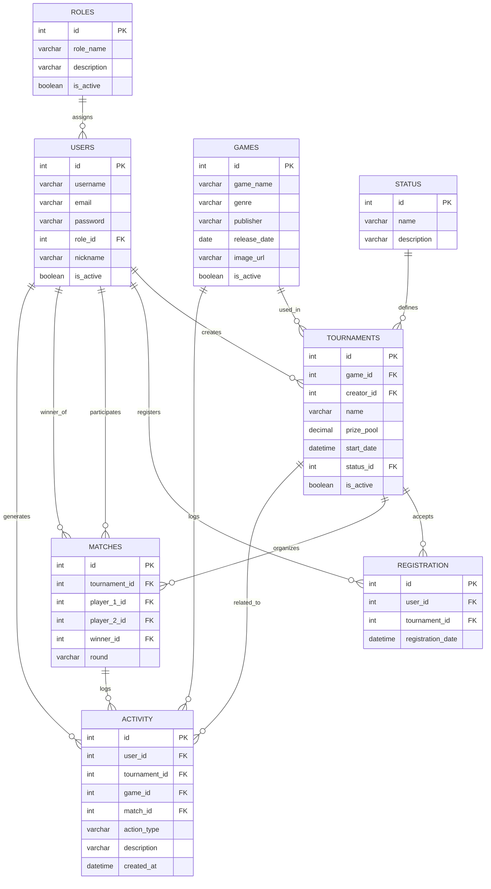

# Software Requirements Specification (SRS)
## eSports Tournament Database System

---

<table>
  <tr>
    <th>Field</th>
    <th>Detail</th>
  </tr>
  <tr>
    <td><strong>Version</strong></td>
    <td>10.0.0</td>
  </tr>
  <tr>
    <td><strong>Date</strong></td>
    <td>2026-06-04</td>
  </tr>
  <tr>
    <td><strong>Status</strong></td>
    <td>In development — JWT authentication implemented, core flow stable</td>
  </tr>
  <tr>
    <td><strong>Repository</strong></td>
    <td><a>https://github.com/olazocaamano/VideoGames-Tournament</a></td>
  </tr>
  <tr>
    <td rowspan="4"><strong>Stack</strong></td>
    <td> React</td>
  </tr>
  <tr>
    <td> Node.js</td>
  </tr>
  <tr>
    <td> Express.js</td>
  </tr>
  <tr>
    <td> MySQL</td>
  </tr>
  <tr>
    <td><strong>License</strong></td>
    <td>Academic</td>
  </tr>
</table>

---

## Table of Contents

1. [Introduction](#1-introduction)
2. [General System Description](#2-general-system-description)
3. [Development Team](#3-development-team)
4. [User Roles](#4-user-roles)
5. [Functional Requirements](#5-functional-requirements)
6. [Non-Functional Requirements](#6-non-functional-requirements)
7. [Technology Stack](#7-technology-stack)
8. [System Architecture](#8-system-architecture)
9. [Project Structure](#9-project-structure)
10. [REST API — Endpoints](#10-rest-api--endpoints)
11. [Database Model](#11-database-model)
12. [Entity-Relationship Diagram](#12-entity-relationship-diagram)
13. [Sprint History](#13-sprint-history)
14. [Constraints and Assumptions](#14-constraints-and-assumptions)
15. [Glossary](#15-glossary)

---

## 1. Introduction

### 1.1 Purpose
This document specifies the software requirements for the **eSports Tournament Database System**, a full-stack web application for managing competitive video game tournaments. It serves as the official technical reference for the development team throughout the entire project lifecycle.

### 1.2 Scope
The system allows users to create, manage, and participate in video game tournaments through a web platform. The modules covered in the current version (v10.0.0) are:

- Authentication and role-based access control
- Tournament management (full CRUD)
- Player registration and tournament enrollment
- Video game catalog and carousel
- Admin statistics dashboard
- System activity logging

Features such as real-time brackets, advanced analytics, and notifications are **in progress** or planned for future versions.

### 1.3 Definitions and Acronyms

| Term     | Description                                                                  |
| -------- | ---------------------------------------------------------------------------- |
| SRS      | Software Requirements Specification                                          |
| MERN*    | Stack based on MySQL (instead of MongoDB) + Express + React + Node.js        |
| REST API | HTTP programming interface using JSON format                                 |
| JWT      | JSON Web Token — stateless authentication mechanism                          |
| ORM      | Object-Relational Mapper                                                     |
| CRUD     | Create, Read, Update, Delete                                                 |
| MVC      | Model-View-Controller — backend architectural pattern                        |
| DDL      | Data Definition Language — SQL statements for creating structures            |
| DGETI    | Dirección General de Educación Tecnológica Industrial (academic institution) |

> *The stack is referred to as adapted MERN: MySQL replaces MongoDB as the relational database engine.

---

## 2. General System Description

### 2.1 Product Perspective
The system is a Single Page Application (SPA) with a client-server architecture:

```
┌──────────────────────┐          HTTP / REST / JSON         ┌────────────────────────┐
│   Frontend           │  ◄─────────────────────────────►    │   Backend              │
│   React + Axios      │                                     │   Node.js + Express    │
│   React Router DOM   │                                     │   MVC Pattern          │
│   Chart.js           │                                     │   bcrypt + JWT         │
└──────────────────────┘                                     └──────────┬─────────────┘
                                                                        │ mysql2 driver
                                                              ┌─────────▼──────────────┐
                                                              │   MySQL 8              │
                                                              │   8 relational tables  │
                                                              └────────────────────────┘
```

### 2.2 Project Objectives
- Simplify the organization and administration of e-sports tournaments
- Improve player registration and participant management
- Provide secure authentication and role-based access control
- Track system activity and tournament statistics
- Maintain a scalable and normalized relational database
- Deliver a modern and responsive user interface

### 2.3 Current System Status
The system has a complete and functional core flow:

```
Register → Login → Browse games → Join tournament → Admin panel
```

Frontend, backend, and database are fully integrated. All main modules are stable.

---

## 3. Development Team

| Role                                | Member                     | Main Responsibility                                        |
| ----------------------------------- | -------------------------- | ---------------------------------------------------------- |
| 📊 Analyst & Designer (Architect)    | Galán Torres Citlalli      | ERD modeling, normalization (3NF), Data Dictionary         |
| 💾 SQL Developer (Builder)           | Olazo Caamaño Emmanuel     | DDL, data types, constraints, foreign keys, SQL scripts    |
| 🔎 Query Master (Manipulator)        | Jimenez Solis Caleb        | Seed data, JOIN queries, business intelligence reports     |
| 🧪 QA / Tester (Breaker)             | Lopez Gil Dilan Osmar      | Integration testing, referential integrity validation      |
| 🛡️ Database Administrator (Guardian) | Aguilar Medina Angel Uriel | Security, permissions, backups, final deliverable assembly |

---

## 4. User Roles

### 4.1 Administrator (`admin`)
Full system access. Manages tournaments, views statistics, and oversees player registration.

**Capabilities:**
- Log in with administrator credentials
- Create, edit, delete, and change the status of tournaments
- View the complete list of enrolled players per tournament
- Access the statistics dashboard (Chart.js)
- View the system activity log

### 4.2 Player / Participant (`player`)
Registered user who participates in tournaments.

**Capabilities:**
- Register and log in to the platform
- Browse the video game catalog (carousel)
- View available tournaments and their details
- Enroll in or cancel enrollment from open tournaments
- View their profile and tournaments they are participating in

> Roles are managed through the **ROLES** table in the database, linked to **USERS** via `role_id`. ENUM is not used directly in the users table.

---

## 5. Functional Requirements

### 5.1 Authentication Module

| ID    | Requirement                                                                                        | Priority |
| ----- | -------------------------------------------------------------------------------------------------- | -------- |
| RF-01 | The system must allow new players to register with a username, email, password, and nickname.      | High     |
| RF-02 | The system must authenticate users via username/email and password and issue a JWT token.          | High     |
| RF-03 | Passwords must be stored encrypted using **bcrypt**.                                               | High     |
| RF-04 | The system must differentiate permissions based on the authenticated user's role (admin / player). | High     |
| RF-05 | The system must validate that `username` and `email` are unique across all accounts.               | High     |
| RF-06 | The system must manage active/inactive account status (`is_active`).                               | Medium   |
| RF-30 | The system must issue a signed JWT token upon successful login and registration.                   | High     |
| RF-31 | All protected API endpoints must validate the JWT token on every request.                          | High     |
| RF-32 | Admin-only endpoints must reject requests from non-admin roles with a 403 response.                | High     |
| RF-33 | Database credentials and JWT secret must be stored in environment variables (`.env`).              | High     |

### 5.2 Tournament Management Module

| ID    | Requirement                                                                                                 | Priority |
| ----- | ----------------------------------------------------------------------------------------------------------- | -------- |
| RF-07 | The administrator must be able to create a tournament with: name, game, prize pool, start date, and status. | High     |
| RF-08 | The administrator must be able to edit the data of an existing tournament.                                  | High     |
| RF-09 | The administrator must be able to delete a tournament.                                                      | High     |
| RF-10 | The system must list all available tournaments for players.                                                 | High     |
| RF-11 | The system must display the full details of a tournament when selected.                                     | Medium   |
| RF-12 | The administrator must be able to change a tournament's status via `PUT /api/tournaments/:id/status`.       | High     |
| RF-13 | Valid tournament statuses must be defined in the **STATUS** table in the database.                          | High     |

### 5.3 Registration and Enrollment Module

| ID    | Requirement                                                                                                        | Priority |
| ----- | ------------------------------------------------------------------------------------------------------------------ | -------- |
| RF-14 | An authenticated player must be able to enroll in an available tournament.                                         | High     |
| RF-15 | The system must prevent a player from registering twice in the same tournament (`UNIQUE(user_id, tournament_id)`). | High     |
| RF-16 | A player must be able to cancel their enrollment while the tournament allows it.                                   | Medium   |
| RF-17 | The administrator must be able to view the complete list of enrolled players per tournament.                       | High     |
| RF-18 | The system must show a player the tournaments they are enrolled in.                                                | Medium   |

### 5.4 Video Games Module

| ID    | Requirement                                                                      | Priority |
| ----- | -------------------------------------------------------------------------------- | -------- |
| RF-19 | The system must expose a `GET /api/games` endpoint for the game catalog.         | High     |
| RF-20 | The frontend must display available games in a dynamic carousel.                 | Medium   |
| RF-21 | The system must correctly serve static images for each game.                     | Medium   |
| RF-22 | Tournaments must be associated with a game from the **GAMES** table (`game_id`). | High     |

### 5.5 Statistics Module (Admin Dashboard)

| ID    | Requirement                                                                                                                                      | Priority |
| ----- | ------------------------------------------------------------------------------------------------------------------------------------------------ | -------- |
| RF-23 | The admin panel must display system metrics: total tournaments, active tournaments, finished tournaments, total players, and average prize pool. | High     |
| RF-24 | Statistics must be visualized through dynamic charts using **Chart.js**.                                                                         | High     |
| RF-25 | Charts must be responsive and adapt to dark mode.                                                                                                | Medium   |

### 5.6 Activity Logging Module

| ID    | Requirement                                                                                                                                      | Priority |
| ----- | ------------------------------------------------------------------------------------------------------------------------------------------------ | -------- |
| RF-26 | The system must automatically log relevant events in the **ACTIVITY** table: user creation, tournament creation, enrollments, and match results. | Medium   |
| RF-27 | Each activity record must include: the related user, affected tournament/game/match, action type, and a human-readable description.              | Medium   |

### 5.7 Matches Module (In Progress)

| ID    | Requirement                                                                                             | Priority |
| ----- | ------------------------------------------------------------------------------------------------------- | -------- |
| RF-28 | The system must allow logging matches associated with a tournament, including two players and a winner. | Medium   |
| RF-29 | Matches must indicate the tournament round (e.g., Quarter-finals, Semi-finals, Final).                  | Low      |

---

## 6. Non-Functional Requirements

### 6.1 Performance
- The API must respond in under **500 ms** for 95% of requests under normal load.
- The SPA must load in under **3 seconds** on a standard connection.

### 6.2 Security
- All production communication must use **HTTPS**.
- Passwords must be stored exclusively using **bcrypt** (no plain text).
- Sensitive credentials (DB, JWT secret) must be managed via environment variables (`.env` + `dotenv`).
- Backend input validation must be applied to prevent SQL injection and XSS attacks.
- The backend must configure **CORS** to accept only authorized origins.
- Protected endpoints must validate the JWT on every request.

### 6.3 Availability
- The system must be available at least **99%** of the time during active usage hours.

### 6.4 Usability
- The interface must be responsive: functional on both desktop and mobile devices.
- The admin panel must include dark mode support.
- Error messages must be clear and indicate the corrective action to the user.
- The UI must include an autocomplete search component for tournaments.

### 6.5 Maintainability
- The backend follows the **MVC** pattern (controllers, routes, utils).
- The frontend follows a modular structure: `pages`, `components`, `services`, `utils`, `hooks`.
- All HTTP calls from the frontend are centralized in the `services` layer (Axios).
- All changes are documented in `CHANGELOG.md` using component version prefixes.

---

## 7. Technology Stack

### Frontend

| Technology       | Purpose                           |
| ---------------- | --------------------------------- |
| React.js         | User interface framework (SPA)    |
| React Router DOM | Client-side routing               |
| Axios            | HTTP client for API communication |
| Chart.js         | Statistics visualization          |
| react-chartjs-2  | Chart.js wrapper for React        |
| CSS3 / JS (ES6+) | Styling and client-side logic     |

### Backend

| Technology | Purpose                           |
| ---------- | --------------------------------- |
| Node.js    | Server-side JavaScript runtime    |
| Express.js | Web framework for the REST server |
| mysql2     | MySQL connection driver           |
| bcrypt     | Password hashing                  |
| dotenv     | Environment variable management   |
| CORS       | Cross-origin access control       |
| jsonwebtoken | JWT signing and verification     |

### Database

| Technology            | Purpose                              |
| --------------------- | ------------------------------------ |
| MySQL 8               | Relational database engine           |
| DDL / SQL             | Schema definition and manipulation   |
| Foreign Keys & UNIQUE | Referential integrity and uniqueness |
| Normalization (3NF)   | Relational design without redundancy |

### Development Tools

| Tool               | Purpose                                     |
| ------------------ | ------------------------------------------- |
| Visual Studio Code | Primary code editor                         |
| Git + GitHub       | Version control and repository              |
| npm                | Package manager                             |
| Postman            | Endpoint testing and validation             |
| MySQL Workbench    | Visual database administration              |
| nodemon            | Automatic server restart during development |

---

## 8. System Architecture

The project follows a **client-server** architecture with an **MVC** pattern on the backend:

```
Frontend (React SPA)
│
│  services/api.js                  ← Centralized services layer (Axios)
│  services/tournamentService.js
│  services/userService.js
│
│  HTTP Requests (JSON)
▼
Backend (Node.js + Express)
│
│  routes/          ← Route definitions (/api/users, /api/tournaments, /api/games)
│  controllers/     ← Business logic per module
│  utils/           ← Helper functions (auth, validations)
│  db.js            ← MySQL connection (mysql2)
│  index.js         ← Server entry point
│
▼
MySQL 8 Database
│
│  8 relational tables
│  Foreign keys and constraints
│  3rd Normal Form normalization
```

---

## 9. Project Structure

```
VideoGames-Tournament/
│
├── backend/
│   ├── controllers/       ← Business logic per module
│   ├── routes/            ← Express route definitions
│   ├── uploads/           ← Static files (game images)
│   ├── utils/             ← Helper functions
│   ├── db.js              ← MySQL connection configuration
│   └── index.js           ← Server entry point
│
├── frontend/
│   ├── public/
│   └── src/
│       ├── components/    ← Reusable UI components
│       │   ├── CreateTournament.jsx
│       │   ├── TournamentList.jsx
│       │   ├── ActivityList.jsx
│       │   └── Modal.jsx
│       ├── pages/         ← Main views
│       │   ├── Home.jsx
│       │   ├── Admin.jsx
│       │   ├── Player.jsx
│       │   ├── AdminLogin.jsx
│       │   └── UserRegister.jsx
│       ├── services/      ← API communication layer
│       │   ├── api.js
│       │   ├── tournamentService.js
│       │   └── userService.js
│       ├── hooks/
│       ├── utils/
│       │   └── formatDate.js
│       ├── resources/     ← Images and static assets
│       ├── App.jsx
│       └── main.jsx
│
├── docs/scrum/            ← Backlog and sprint details
├── CHANGELOG.md
├── README.md
└── package.json
```

---

## 10. REST API — Endpoints

### Users
| Method | Endpoint              | Description                       | Access |
| ------ | --------------------- | --------------------------------- | ------ |
| POST   | `/api/users/register` | Register a new player             | Public |
| POST   | `/api/users/login`    | Authenticate user and issue token | Public |
| GET    | `/api/users`          | List all registered players       | Admin  |

### Tournaments
| Method | Endpoint                      | Description                     | Access |
| ------ | ----------------------------- | ------------------------------- | ------ |
| GET    | `/api/tournaments`            | List all tournaments            | Public |
| POST   | `/api/tournaments`            | Create a new tournament         | Admin  |
| PUT    | `/api/tournaments/:id`        | Edit an existing tournament     | Admin  |
| DELETE | `/api/tournaments/:id`        | Delete a tournament             | Admin  |
| PUT    | `/api/tournaments/:id/status` | Change tournament status        | Admin  |
| POST   | `/api/tournaments/register`   | Enroll a player in a tournament | Player |

### Games
| Method | Endpoint     | Description                     | Access |
| ------ | ------------ | ------------------------------- | ------ |
| GET    | `/api/games` | Retrieve the video game catalog | Public |

---

## 11. Database Model

The system contains **8 relational tables** in MySQL, designed in Third Normal Form (3NF).

### ROLES
| Field       | Type         | Constraint         | Description                                    |
| ----------- | ------------ | ------------------ | ---------------------------------------------- |
| id          | INT          | PK, AUTO_INCREMENT | Unique role identifier                         |
| role_name   | VARCHAR(50)  | NOT NULL, UNIQUE   | Role name (admin, player)                      |
| description | VARCHAR(255) | NULL               | Role description and its system permissions    |
| is_active   | BOOLEAN      | DEFAULT TRUE       | Indicates whether the role is currently active |

### USERS
| Field     | Type         | Constraint              | Description                             |
| --------- | ------------ | ----------------------- | --------------------------------------- |
| id        | INT          | PK, AUTO_INCREMENT      | Unique user identifier                  |
| username  | VARCHAR(50)  | NOT NULL, UNIQUE        | Username for login                      |
| email     | VARCHAR(100) | NOT NULL, UNIQUE        | User email address                      |
| password  | VARCHAR(255) | NOT NULL                | bcrypt-hashed password                  |
| role_id   | INT          | FK → ROLES.id, NOT NULL | Role assigned to the user               |
| nickname  | VARCHAR(50)  | NOT NULL                | In-game name displayed in tournaments   |
| is_active | BOOLEAN      | NOT NULL                | Indicates whether the account is active |

### STATUS
| Field       | Type         | Constraint         | Description                                |
| ----------- | ------------ | ------------------ | ------------------------------------------ |
| id          | INT          | PK, AUTO_INCREMENT | Tournament status identifier               |
| name        | VARCHAR(50)  | UNIQUE, NOT NULL   | Status name (open, in progress, finished…) |
| description | VARCHAR(255) | NULL               | Optional status description                |

### GAMES
| Field        | Type         | Constraint         | Description                             |
| ------------ | ------------ | ------------------ | --------------------------------------- |
| id           | INT          | PK, AUTO_INCREMENT | Unique game identifier                  |
| game_name    | VARCHAR(100) | NOT NULL, UNIQUE   | Official video game title               |
| genre        | VARCHAR(50)  | NOT NULL           | Game category (FPS, MOBA, RPG…)         |
| publisher    | VARCHAR(100) | NULL               | Publishing company                      |
| release_date | DATE         | NULL               | Official launch date                    |
| image_url    | VARCHAR(255) | NULL               | URL or path to the game's cover image   |
| is_active    | BOOLEAN      | NOT NULL           | Indicates whether the game is available |

### TOURNAMENTS
| Field      | Type          | Constraint              | Description                                   |
| ---------- | ------------- | ----------------------- | --------------------------------------------- |
| id         | INT           | PK, AUTO_INCREMENT      | Unique tournament identifier                  |
| name       | VARCHAR(100)  | NOT NULL                | Official event name                           |
| game_id    | INT           | FK → GAMES.id, NOT NULL | Game associated with the tournament           |
| prize_pool | DECIMAL(12,2) | NOT NULL                | Total cash prize amount                       |
| start_date | DATETIME      | NOT NULL                | Scheduled start date and time                 |
| status_id  | INT           | FK → STATUS.id          | Current tournament status                     |
| creator_id | INT           | FK → USERS.id, NOT NULL | Administrator who created the tournament      |
| is_active  | BOOLEAN       | NOT NULL                | Indicates whether the tournament is available |

### REGISTRATION
| Field             | Type     | Constraint                    | Description                    |
| ----------------- | -------- | ----------------------------- | ------------------------------ |
| id                | INT      | PK, AUTO_INCREMENT            | Registration record identifier |
| user_id           | INT      | FK → USERS.id, NOT NULL       | Player who is enrolling        |
| tournament_id     | INT      | FK → TOURNAMENTS.id, NOT NULL | Tournament being joined        |
| registration_date | DATETIME | NOT NULL                      | Date and time of enrollment    |

> **Additional constraint:** `UNIQUE(user_id, tournament_id)` — prevents duplicate registrations.

### MATCHES
| Field         | Type        | Constraint                    | Description                                 |
| ------------- | ----------- | ----------------------------- | ------------------------------------------- |
| id            | INT         | PK, AUTO_INCREMENT            | Match identifier                            |
| tournament_id | INT         | FK → TOURNAMENTS.id, NOT NULL | Tournament this match belongs to            |
| player_1_id   | INT         | FK → USERS.id, NOT NULL       | First participant                           |
| player_2_id   | INT         | FK → USERS.id, NOT NULL       | Second participant                          |
| winner_id     | INT         | FK → USERS.id, NULL           | Winning player (null if no result yet)      |
| round         | VARCHAR(50) | NOT NULL                      | Tournament round (Quarter-finals, Final, …) |

### ACTIVITY
| Field         | Type         | Constraint                          | Description                                          |
| ------------- | ------------ | ----------------------------------- | ---------------------------------------------------- |
| id            | INT          | PK, AUTO_INCREMENT                  | Unique activity record identifier                    |
| user_id       | INT          | FK → USERS.id, NULL                 | User who performed the action                        |
| tournament_id | INT          | FK → TOURNAMENTS.id, NULL           | Related tournament (if applicable)                   |
| game_id       | INT          | FK → GAMES.id, NULL                 | Related game (if applicable)                         |
| match_id      | INT          | FK → MATCHES.id, NULL               | Related match (if applicable)                        |
| action_type   | VARCHAR(50)  | NOT NULL                            | Action type (CREATE_USER, REGISTER, CREATE_MATCH, …) |
| description   | VARCHAR(255) | NOT NULL                            | Human-readable message displayed on the frontend     |
| created_at    | DATETIME     | NOT NULL, DEFAULT CURRENT_TIMESTAMP | Date and time when the event occurred                |

### Relationship Summary

| Parent Table | Child Table  | Cardinality | Description                                        |
| ------------ | ------------ | :---------: | -------------------------------------------------- |
| ROLES        | USERS        |    1 : N    | A role can be assigned to many users               |
| STATUS       | TOURNAMENTS  |    1 : N    | A status can be applied to multiple tournaments    |
| GAMES        | TOURNAMENTS  |    1 : N    | A game can have multiple associated tournaments    |
| USERS        | TOURNAMENTS  |    1 : N    | A user (admin) can create multiple tournaments     |
| USERS        | REGISTRATION |    1 : N    | A player can register for multiple tournaments     |
| TOURNAMENTS  | REGISTRATION |    1 : N    | A tournament accepts multiple player registrations |
| USERS        | TOURNAMENTS  |    N : M    | N:M relationship implemented through REGISTRATION  |
| TOURNAMENTS  | MATCHES      |    1 : N    | A tournament organizes multiple matches            |
| USERS        | MATCHES      |    1 : N    | Users participate as players in matches            |
| MATCHES      | ACTIVITY     |    1 : N    | Matches may generate activity records              |
| GAMES        | ACTIVITY     |    1 : N    | Games may be referenced in activity logs           |
| TOURNAMENTS  | ACTIVITY     |    1 : N    | Tournament events may generate activity records    |

---

## 12. Entity-Relationship Diagram



---

## 13. Sprint History

The project follows an **adapted Scrum methodology**, organized into 4 sprints:

| Sprint | Version          | Date                 | Main Focus                                                                     |
| ------ | ---------------- | -------------------- | ------------------------------------------------------------------------------ |
| 1      | v0.6.0 – v0.7.3  | Mar 10–12, 2026      | Database foundation: STATUS, ROLES tables, ERD, data dictionary                |
| 2      | v0.8.1 – v0.8.6  | Mar 23 – Apr 5, 2026 | Modular frontend structure and player visualization                            |
| 3      | v0.9.0           | Apr 8, 2026          | Security: bcrypt encryption, validations, error handling                       |
| 4      | v0.9.5 – v9.8.0  | Apr 22 – May 5, 2026 | Tournament management, enrollment, Chart.js statistics, full integration       |
| 5      | v10.0.0          | Jun 4, 2026          | JWT authentication, database FKs, environment variables, security hardening    |

### Current Status (v10.0.0 — June 4, 2026)

**Implemented:**
- JWT token-based authentication with role-based authorization
- Server-side route protection via auth middleware
- Environment variable configuration (`.env`) for credentials and JWT secret
- FOREIGN KEY constraints on all 8 database tables
- Centralized Axios service with automatic JWT attachment
- Complete flow: Register → Login → Browse games → Enroll → Admin panel
- Player tournament enrollment with autocomplete search
- Dynamic admin statistics (Chart.js)
- Metrics: total tournaments, active, finished, total players, average prize pool

**In Progress:**
- Tournament status management (finish / cancel tournaments)
- Player participation analytics per tournament
- Advanced statistics with time-based activity tracking
- Admin controls for registrations

---

## 14. Constraints and Assumptions

### 14.1 Constraints
- The system is exclusively **web-based** (no native mobile app in this version).
- An internet connection is required for operation.
- MySQL 8 must be available in the deployment environment.
- The project operates under an **academic license** (DGETI context).
- Third-party platform integrations (Steam, Battle.net, etc.) are not contemplated in this version.

### 14.2 Assumptions
- Users have a modern browser (up-to-date Chrome, Firefox, or Edge).
- The administrator account is created via a seed script or directly in the database.
- Environment variables (`.env`) are managed securely and are not versioned in the repository.
- The database runs on a local server or a shared development environment.

---

## 15. Glossary

| Term         | Definition                                                                      |
| ------------ | ------------------------------------------------------------------------------- |
| Tournament   | Organized competition between players for a specific video game                 |
| Registration | Formal enrollment of a player in an available tournament                        |
| Match        | Direct encounter between two players within a tournament                        |
| Bracket      | Head-to-head elimination chart (out of scope for v1)                            |
| Status       | Current phase of a tournament managed through the STATUS table                  |
| Prize Pool   | Total monetary prize amount for a tournament                                    |
| JWT          | Digitally signed token used to authenticate API requests                        |
| bcrypt       | Hashing algorithm used to securely store user passwords                         |
| SPA          | Single Page Application — single-page web application (React)                   |
| MVC          | Model-View-Controller — backend architectural pattern                           |
| DDL          | Data Definition Language — SQL statements for creating and modifying structures |
| 3NF          | Third Normal Form — level of database normalization                             |
| Seed         | SQL script that loads initial or test data into the database                    |
| CORS         | Cross-Origin Resource Sharing — cross-domain access control policy              |

---

*Document generated for the eSports Tournament Database System project — v10.0.0*  
*Development team: DGETI — 2026*